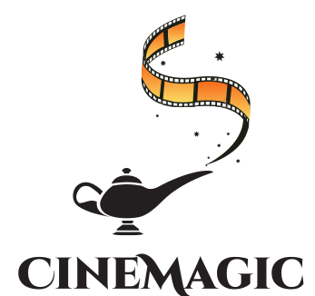

## Contributors 
- [Šahović Tarik](https://github.com/tsahovic1 "Github")
- [Đokić Kanita](https://github.com/kdokic1 "Github")
- [Ćelosmanović Selma](https://github.com/scelosmano1 "Github")

## Overview

CineMagic application solves the problem of cinema ticket reservations. You can check movie projections 7 days in advance. It includes projection time and movies duration. Movie details and trailer are also included. The best features are that you can choose your seat, pay reservation using our CineCard and get so many discounts. Stay up to date with popular movies, save your time and avoid waiting in lines by visiting our CineMagic.

## Features 

* Checking movie projections
* Ticket reservation
* Seat selection
* CineCard payment
* Trailer preview
* Refund in case of cancelling reservation 24 hours before projection

## Tech
* .NetCore
* HTML
* CSS
* Entity Framework

####
This project is my first Web application. Check final documentation for CineMagic video.
